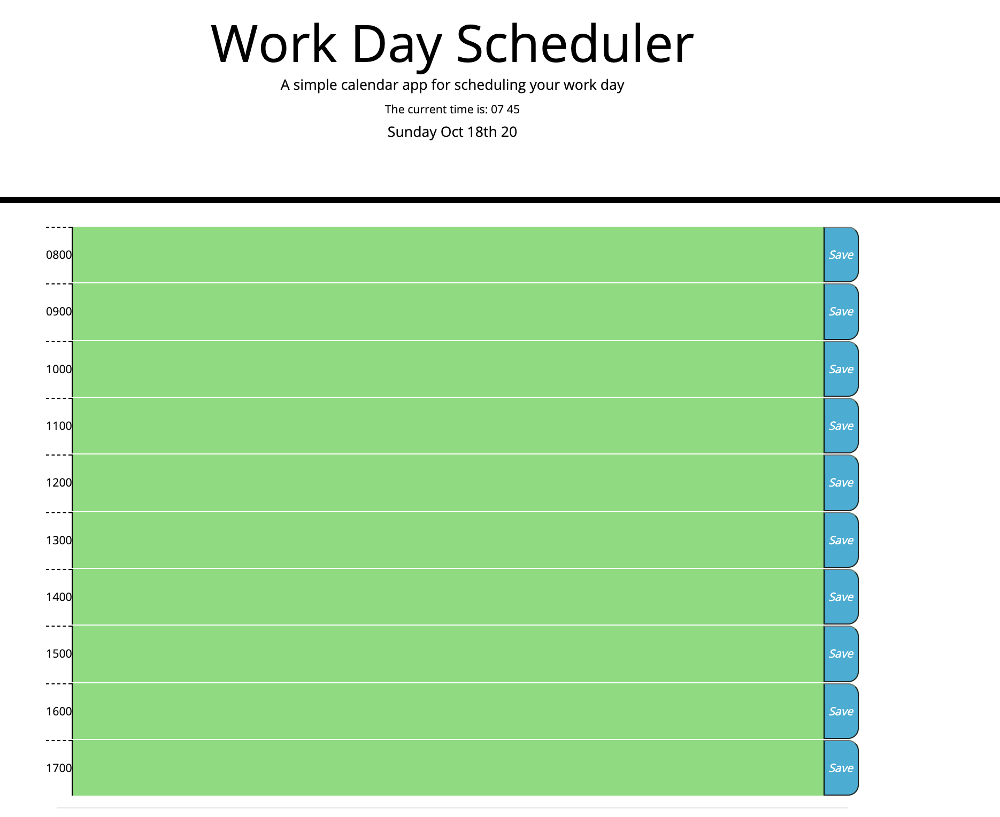

# EsprayDayPlanner

Welcome to your daily planner!  This in-browser app is useful for a quick standard business day guide.  

**What does this project do?**

This project allows you to click and type any important reminders for the day.  Have an important call at 2PM?  Click on the box next to 1400 and type yourself your reminder.  This project was built in a 24 hour time format to easily distinguish between morning, afternoon and evening.  

**Why the project is useful?**

This project has a built in time display to get the current accurate time and compare against the prebuilt time slots on the planner.  It has been color coded to quickly identify the past, the present and the future.  And the best part is that it happens automatically!  Also, once you enter in your details for the day, since it is a browser there is a risk that your information is lost once the browser is closed.  No need to worry about that with this project as all of your info is automatically saved in your Local storage and loads once you open the page!

**How users can get started with the project?**

Open up the link and select a timeblock to enter your details.  Click on the save button on the right of the timeblock to save your information.  Once you reload the page your information for the day will load automatically! 

A the link to the applcation is available here: 
https://johnsondavid1107.github.io/EsprayDayPlanner/

**Where users can get help with your project?**

Any questions on the project please feel free to email me directly.  **johnsondavid1107@gmail.com**

**Who maintains and contributes to the project?**

Created and maintained by David Johnson.

